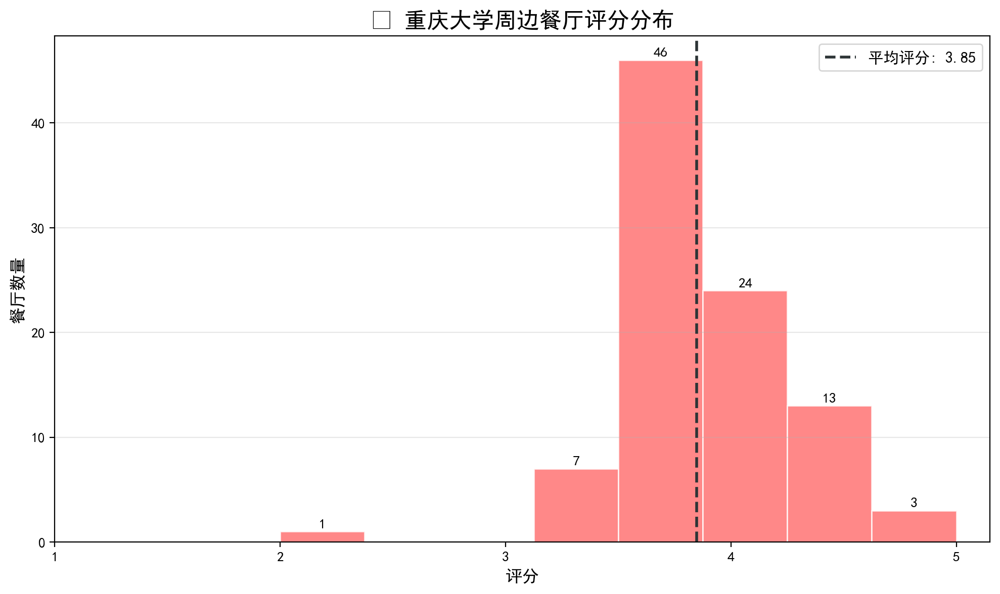
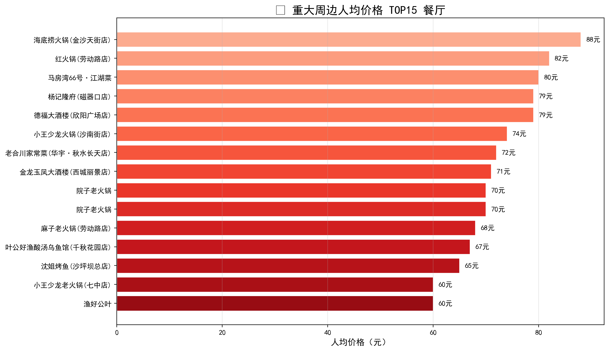
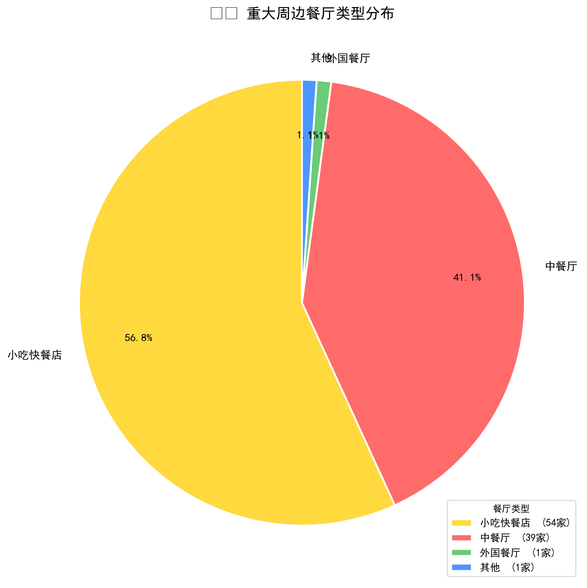
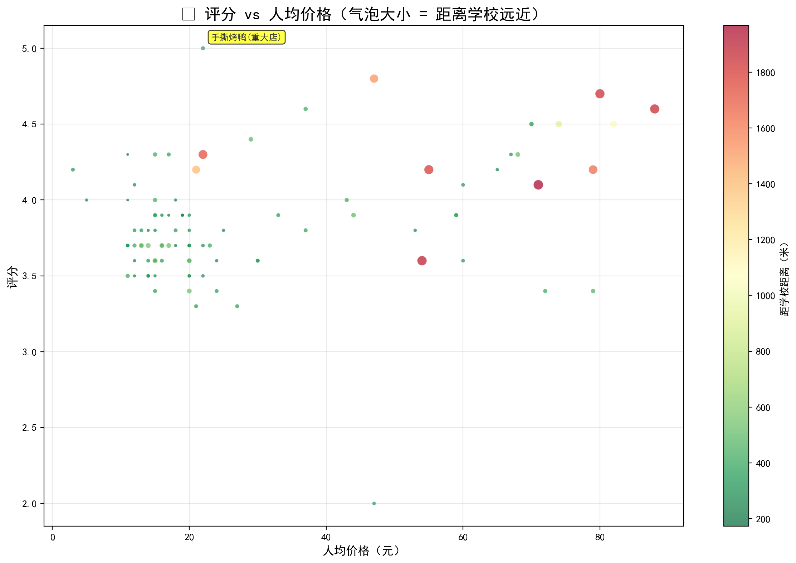
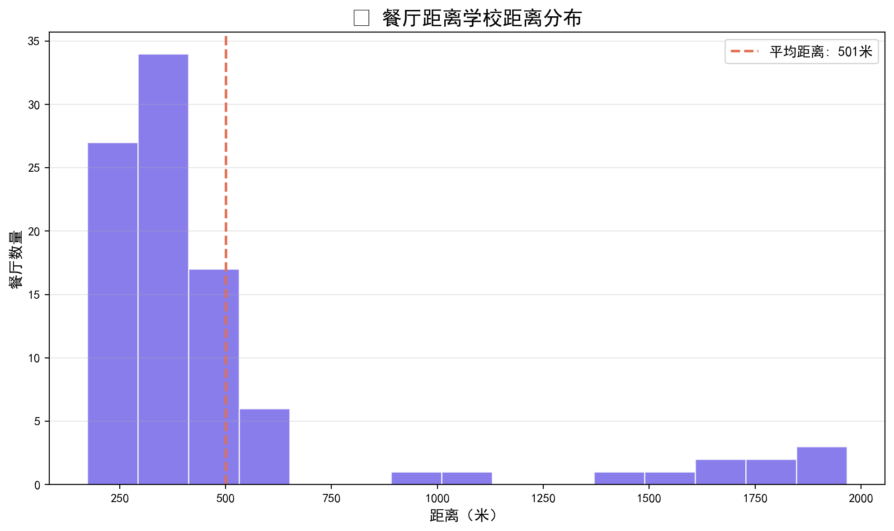

# 🍜 重庆大学周边餐厅数据分析

> 大一自学 Python 的第一个完整项目 🎉

## 📋 项目简介

通过百度地图 Place API，爬取**重庆大学 A 区周边 2 公里**范围内共 **95 家**餐厅数据，进行数据清洗、统计分析与可视化展示。

## 🛠️ 技术栈

| 技术 | 用途 |
|------|------|
| Python | 主编程语言 |
| 百度地图 Place API | 获取 POI 数据 |
| Pandas | 数据处理 |
| Matplotlib | 数据可视化 |
| OpenPyXL | Excel 导出 |

## 📊 分析结果

- 🏪 共采集 **95 家**餐厅
- ⭐ 平均评分 **3.8 分**（满分 5 分）
- 💰 人均价格范围 **3 元 ~ 88 元**
- 📏 大部分餐厅距学校 **200~500 米**

## 🏆 推荐榜单

| 店铺 | 评分 | 人均 | 推荐理由 |
|------|:---:|:----:|:---------|
| 手撕烤鸭(重大店) | ⭐5.0 | 22元 | 满分性价比之王 |
| 李木桶沾水米线 | ⭐4.3 | 11元 | 便宜好吃，距学校仅173米 |
| 恒丰包子 | ⭐4.2 | 3元 | 最便宜！早餐首选 |
| 爱厨梁山鸡 | ⭐4.8 | 47元 | 聚餐好去处 |

## 📈 图表展示











## 🚀 快速运行

```bash
# 1. 克隆仓库
git clone https://github.com/yicheng-775/cqu-food-analysis.git
cd cqu-food-analysis

# 2. 安装依赖
pip install requests pandas openpyxl matplotlib

# 3. 运行爬虫（记得替换 API Key）
python cqu_food.py

# 4. 生成图表
python analysis.py
